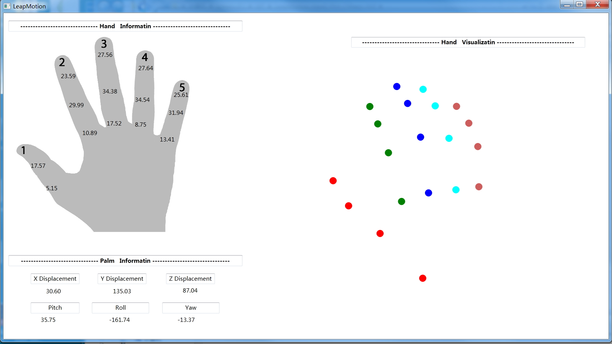

# LeapMotion Hand Plot CSharp GUI
Created in 2016 by YunShuiXin
+ This is a program working with Leap Motion, it detects the position of each main skeleton of human hand and update the image on the GUI.
+ 
+ The data on the left side is the angle between finger bones
+ You can run it directly use the EXE from \LeapMotion_Hand_Plot_CSharp_GUI\LeapMotion_Hand_Plotter\bin\Release
+ This is my first C# program so the code is terrible I guess. I hope it can do you some help.
